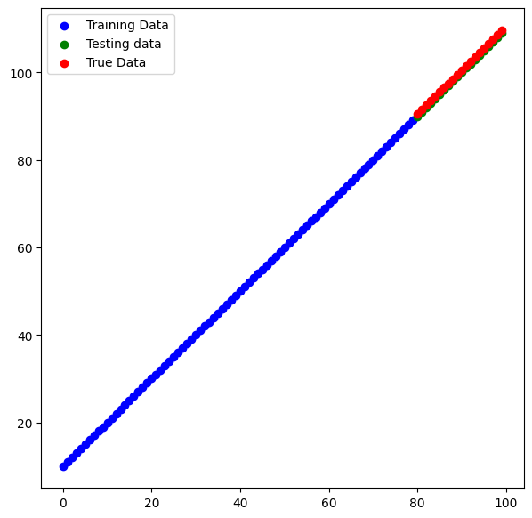

# DevFest 2024

DevFest Glasgow 2024: "Google TensorFlow: Unleashing the Power of Tensors"

## Key Features:

- Sequential Model: A straightforward neural network architecture.
- Dense Layers: Fully connected layers for processing input and output.
- ReLU Activation: Introduces non-linearity to the model.
- Adam Optimizer: Efficiently updates model weights during training.
- Mean Absolute Error Loss: Measures the average absolute difference between predicted and actual values.
## Structure

- Data Generation: Creates a synthetic dataset for training and testing.
- Model Definition: Defines the neural network architecture.
- Model Compilation: Configures the model for training.
- Model Training: Trains the model on the training data.
- Model Evaluation: Evaluates the model's performance on the testing data.
## Screenshots

